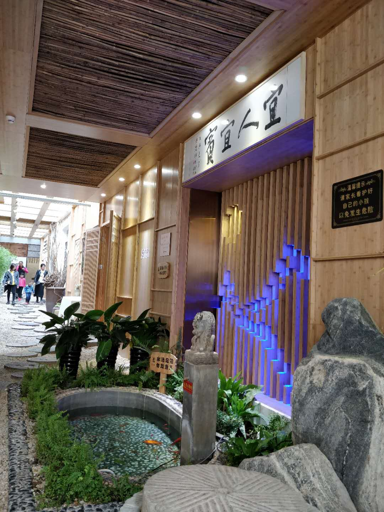
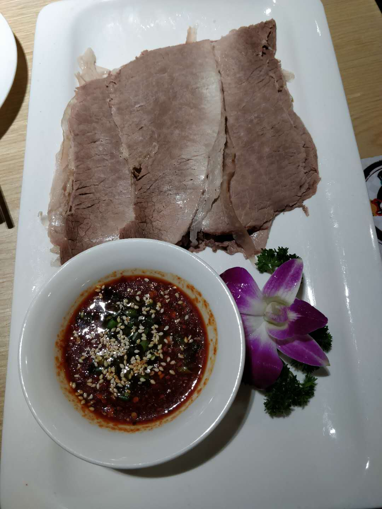
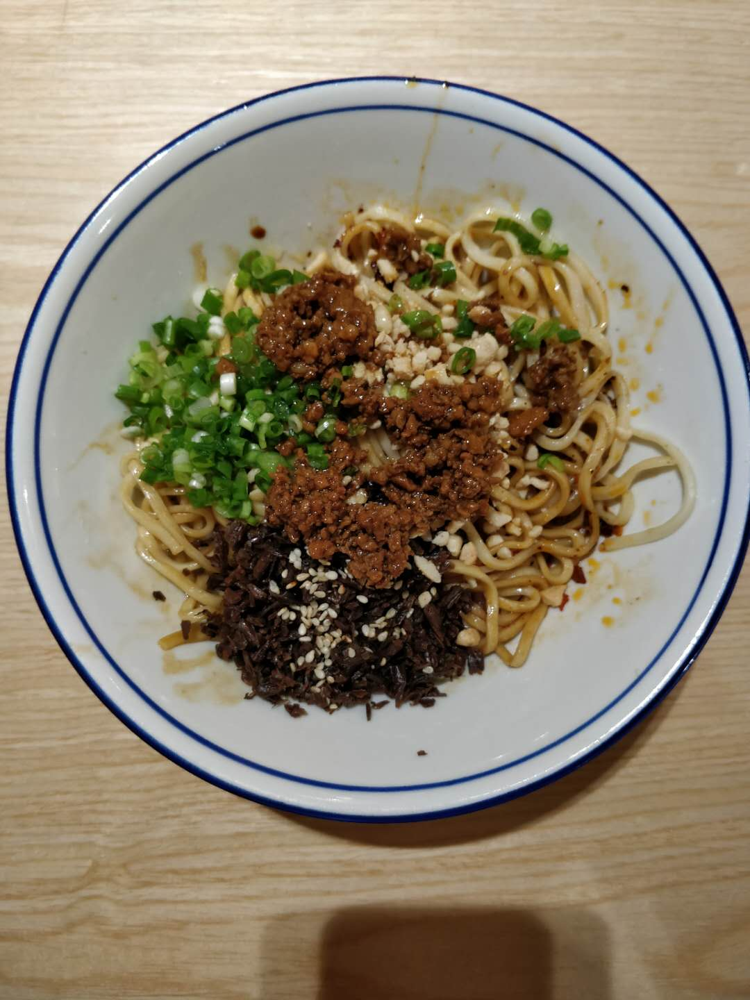
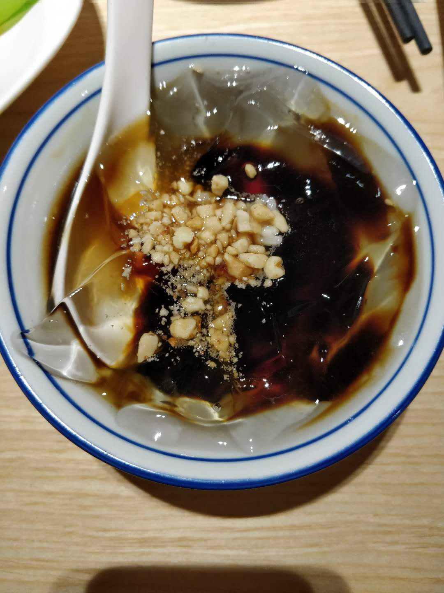
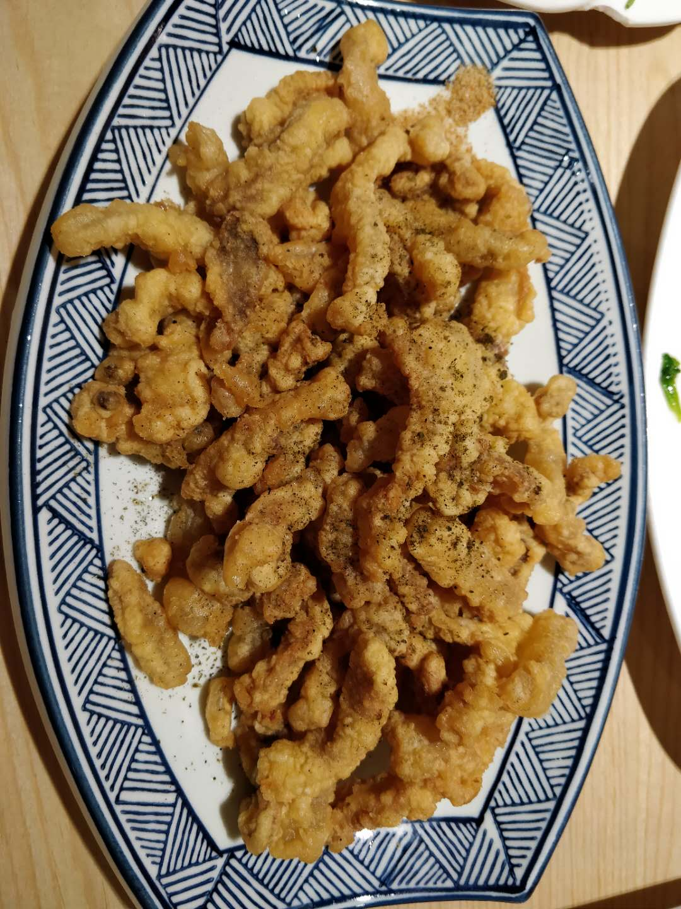

## 尝过
### 北京

#### [宜宾招待所餐厅](http://www.dianping.com/shop/2363059)
- 2019-04-06

- 12点半到的，等了一个小时才吃上

- **蒜泥白肉**：强烈推荐，肉切很薄，沾了酱之后真是美味

- **酒都肥肠**：宜宾是五粮液的产地，所以加酒都吧，第一次吃辣子鸡做法的肥肠，很特别，很辣，很香

- **宜宾燃面**：吃过的燃面里最好吃的

- 小酥肉：肥肉太多，不好吃，跟其他菜的水平差的太多

- 油炸圆白菜：想点个素菜缓解下，结果里面也全是辣椒

- 红糖冰粉：建议人手一份，来应对酒都肥肠

- 人均95,**绝对值得一去**

  

  
  
  
  
  
  
  
  
  

#### [签上签串串香(石佛营店)](http://www.dianping.com/shop/22665864)
- 2019-04-05
- 差不多串串的平均水平吧，小酥肉不行
- 人均60，平时好这口吃也行

#### [撒椒(朝阳大悦城店)](http://www.dianping.com/shop/91073709)
- 2019-03-31
- 水煮鱼：味道不错，量是我吃过的水煮鱼最少的
- 霹雳娇蛙：量也不多，大概6、7只蛙，味道也还行
- 撒椒辣子鸡，芥末黄瓜，红糖啥的味道也都还行吧
- 人均135，3个人吃这些量大了些，味道还行

#### [隐久居酒屋](http://www.dianping.com/shop/111605208)
- 2019-03-17
- 鸡翅饺子，黄油土豆等大众点评推荐的烤串都来了一些，整体味道还是不错的，服务也不错
- 梅子酒感觉一般，主要是性价比比较低，一小杯加一个大冰块，扎啤可以点，味道不错
- 人均180，可以去尝尝

#### [香鼎坊匡庐小馆(星火西路店)](http://www.dianping.com/shop/58832973)
- 2019-03-16
- **红烧肉**非常好吃，有时间还会再来
- 特色南昌炒粉 还行，还有个啥素菜忘了，估计一般
- 人均75，吃红烧肉的话可以去

#### [绥兴盛(큰집 설렁탕)](http://www.dianping.com/shop/8053676)
- 2019-03-08
- 4个人大半夜去吃的，位置挺难找的，在小区里面。感觉味道挺正宗的，吃饭的几乎都是韩国人
- 雪浓汤，辣牛肉汤，孜然心管，炒八爪鱼都挺不错的
- 人均70，性价比可以，环境一般，可以一去

#### [火牛烤肉](http://www.dianping.com/shop/59185698)
- 2019-03-08
- 4个人点的店内牛肉精品套餐，没吃饱加上味道一般，就没继续点了
- 香甜烤牛肉寿司 这种新式的寿司之前还没见过，味道算还行吧
- 不建议去

#### [济州爱肉堂](http://www.dianping.com/shop/111542244)
- 2019-02-19
- 这家要赶在晚上营业前早去，空间很小，不然在门口站着排队很受罪
- 味道挺不错的，算是在北京吃过很好吃的韩式烤肉，香而不腻
- 4个人点的这个[大花猪套餐][http://t.dianping.com/deal/33852239]
- 人均110，推荐去

#### [薛蟠烤串(朝阳大悦城店)](http://www.dianping.com/shop/22644759)
- 2019-02-17
- 大部分大众点评上推荐的烤串都吃了一遍了吧，整体一般，价格比不同烧烤店稍微贵些
- 人均130，不太建议去

#### [湘潮.湘菜小馆](http://www.dianping.com/shop/90377513)
- 2019-01-13
- 剁椒鱼头，砂锅四季豆：中规中矩2个菜
- **长沙臭豆腐**：味道很赞，算是北京吃到的味道不错的
- 炒鸭蛋：算是个特色吧，味道一般，之前没见过这种菜
- 人均80，日常吃饭还行

#### [花牛餐馆](http://www.dianping.com/shop/8941116)
- 2018-10-13 晚 2人
- **老北京炸酱面**：好看，味道不错
- 香酥鲫鱼：性价比高，味道也还不错，鱼刺都是酥的
- 小豆凉糕：味道还行，有点腻，2个人点一份吃不完，打包了
- 直隶府骨渣丸子：味道还行，丸子里还有脆骨
- 杏仁豆腐，酸辣汤：一般
- 人均50，性价比高(大众点评88代100卷)，味道也不错，环境也还行，值得一去

#### [二姐牛蛙](http://www.dianping.com/shop/513816)
- 2018-10-12 晚 2人
- 重庆烧鸡公 2斤 微辣 冻豆腐 萝卜 鸭胗
- 人均80 烧鸡公味道还是蛮不错的，烫菜性价比较低

#### [南街北巷家里饭](http://www.dianping.com/shop/10017644)
- 2018-09-22 午 2人
- **五花肉白菜炖豆腐**：味道不错 很家常
- 麻辣烫鱼片：辣 鱼肉嫩但不鲜
- 虾做疙瘩汤：疙瘩汤中有虾米 味道一般
- 送两小杯绿豆汤
- 人均50  适合熟人家常小聚

#### [接地气的小馆](http://www.dianping.com/shop/65408599)
- 2018-09-09 晚 2人
- 2种口味精酿啤酒味道还行（有一种桂花味） 酒精度数貌似挺高 稍微喝点头晕
- 牛小串、羊小串、鸡小串、鸡爪、五花肉等各类烤串都尝试了下，味道中规
- 人均70-80 啤酒度数很晕人...

- 2018-09-21 晚 打包一份串 人均50

#### [晓寿司](http://www.dianping.com/shop/93940086)
- 2018-09-01 晚 4人
- 刺身、寿司、军舰、细卷基本尝了遍，味道还行
- **绿茶大福**味道不错，但性价比较低
- 鱼子刺身不要点，腥味太重，问了老板说是三文鱼刺身，常人接受不了
- 人均 80  **性价比可以 推荐**

#### [五道双马](http://www.dianping.com/shop/90981703)
- **炸猪排咖喱饭** 大份炸猪排套餐 沙拉
- 人均 50  **炸猪排味道不错 性价比还行 推荐**

#### [大成醉串串](http://www.dianping.com/shop/110357761)
- 离住的地方近，去过5~6次
- 菜的话推荐
  - **现炸酥肉**：必吃过的大部分酥肉好吃，推荐
  - **冒鸭血**、琅琊土豆、豌杂面：性价比高，味道还行
  - 红糖糍粑、冒脑花、霸王鸡爪、老妈蹄花、冰粉、麻辣兔头等一般
  - 跳跳蛙料酒太多，干拌毛肚咸的要命
- 串串味道还行
- 人均50-60 离得近的可以去尝试，在 霍营 附近算味道还行的了

#### [火齐潮汕砂锅粥(五道口店)](http://www.dianping.com/shop/58331899)
- 2018-08-19 2人
- 干贝虾蟹粥：一大份2人吃有点多 味道中规 蟹贝少  虾多
- 蛋黄流沙包 豉汁蒸凤爪 中规

### 杭州
#### [老头儿油爆虾(翠苑店)](http://www.dianping.com/shop/26233646)
- 2018-09-13 午 3人
- 老头儿油爆虾：虾肉挺多，酱油好多
- 干炸带鱼：味道中规
- 老头儿卤鸭：味道中规，酱油好多
- 西湖牛肉羹：酱油好多...
- 人均60-70  啥菜都那么多酱油 :(

### 大连
#### [横杠咖啡商店](http://www.dianping.com/shop/97179380)
一家有特点的咖啡店，主要还是老板很有意思，段子讲的飞起。
点咖啡会先询问要不要加奶，要不要加糖，这让不是经常喝或者不是很懂的客户很舒服。
用心做咖啡，既有情怀，也很理性，通过大数据来分析咖啡的销售占比，希望这种咖啡店越来越多，越办越好。

#### [鳗亭](http://www.dianping.com/shop/90927374)
- **厚切牛舌**：牛舌很厚，味道不错，甜口，可能是根据大连口味适配过
- **鳗鱼两烧**：每次吃鳗鱼都要感慨肥美啊，两个人吃了一整份，还是有点腻的
- 沙拉：两个人菜点多了点，靠这个解腻了
- 还有个甜口的烧鱼头，本来是因为说牛舌没了点着凑数的，牛舌加上之后没退了，味道一般吧

#### [庭院里的小幸福(罗斯福天兴店)](http://www.dianping.com/shop/18778773)
- **芝士烤牛肉卷**：味道不错，之前没吃过这种的
- **我在小幸福吃炸鸡**：还可以的韩式炸鸡，甜辣口
- **海鲜葱煎饼**：还可以，挺香的
- 庭院里的生菜包肉：肉挺香的，不过还是得叶子包着，不然太腻
- 海蛎子巴蛸锅：甜辣口，鱿鱼挺大个
- 幸福的小洋盆拌饭：一直对拌饭没啥兴趣
- 整体是目前在大连最满意的一顿，可能是白天走了太多路饿了导致的

#### [品海楼(柏威年购物广场店)]（http://www.dianping.com/shop/22415512）
- 同事力荐，说来大连玩连吃三顿，按照大众点评点了前面的菜
- 品海小巴蛸：烤焦了，有点甜，一般
- **金牌脆皮虾**：味道还不错，主要是吃起来方便，跟吃虾仁差不多
- 金牌香肴肉：新疆架子肉的袖珍版，味道也不如架子肉，甜口
- 头菜爆活海螺：头菜挺好吃的，嗯，海螺肉是啥，不知道
- 海胆豆腐感觉挺坑
- 总体感觉名气比较大，味道一般

#### [曼听小寨海鲜烧烤(盖州街店)](http://www.dianping.com/shop/21237358)
- 大连玩耍的第一顿海鲜，晚上去的，等了大概半小时
- **烤猪蹄**：味道不错也不腻
- **拌鸡架**：说是大连特色，酸甜口，还不错
- **心管**：看了人生一串想要尝试下，不过不是烤的，热油辣椒泼出来的，挺香的，但是不脆
- 烤海肠：也是看了人生一串尝试的食材，失望
- 辣炒虾爬子，烤鸟贝，醉蟹钳，辣炒方便面，烤鸡爪，**生牛肉小串**都一般吧，虾爬子还挺贵的，九十几一斤

#### [巷子里小酒馆(北京街店)](http://www.dianping.com/shop/44389079)
- 等酒店入住前的午饭
- 嘎巴锅排骨：土豆还行，排骨一般
- **稻香肉**：味道不错，跟毛氏红烧肉味道类似
- 石锅海胆豆腐：一般般
- 可能还有一两道菜忘了，味道肯定也一般了

#### [香港久记牛腩云吞面](http://www.dianping.com/shop/67921048)
- 到大连玩耍的第一餐，味道一般，没啥必要去了

### 锦州
#### [荣鹏风味烀饼(人民街旗舰店)](http://www.dianping.com/shop/90540326)
- **特色豆角烀饼**：味道挺好，看起来北方都喜欢 五花肉+豆角+土豆 的搭配
- 大拉皮，锅包肉 味道还行
- 炒扇贝，还有个啥菜忘了味道不行
- 东北菜量太大，4个人点五个菜吃到心累

#### [锦州御烧烤(人民街店)](http://www.dianping.com/shop/2537497)
- 4个人点了不少，特别的尝试了下羊眼，比想象中的正常，三味烤虾还不错，整体味道感觉一般吧，名气在锦州貌似挺大的

### 塞班
#### [乡村餐厅](http://www.dianping.com/shop/10668803)
- 龙虾牛排套餐，分量挺足的，味道在岛上还行了吧

#### [相遇餐厅](http://www.dianping.com/shop/126643429)
- 岛上味道还不错的川菜馆，想吃中餐的还是可以来的，水煮鱼，鱼香肉丝啥的都还行吧

#### [Capricciosa](http://www.dianping.com/shop/21036502)
- 海鲜饭，感觉有点太酸了，料还是挺足的，量挺大的，一个人吃不完
- 玉米汤，味道不错
- 冰激凌，性价比还行
- 还点了杯喝的，带酒精，忘了叫啥了

#### 其他
- 吃了好几顿麦当劳，同事推荐的国内没有的汉堡Double Quarter Pounder with Cheese还是不错的，炸鸡也不错
- 一家台湾餐馆，牛肉面还不错
- 酒店门口的越南餐馆，坑，性价比低

### 重庆
#### [花市豌杂面(较场口店)](http://www.dianping.com/shop/2315611)
- 网红店，上次到重庆来吃过一次了，感觉味道偏咸，人是真的多

#### [曾老幺鱼庄(长滨路店)](http://www.dianping.com/shop/531247)
- 出租车师父推荐的
- 邮亭鲫鱼
- 香辣虾
- 干锅排骨
- 香辣耗儿鱼
- 应该是很正宗的江湖菜，本地人挺多的，不过感觉还是偏咸，味道还是不错的

#### [蒋六十八梯眼镜面](http://www.dianping.com/shop/531344)
- 上次到重庆吃过一次，一直恋恋不忘，味道是**真的好**，下次去重庆还得吃
- 牛肉面还是比较贵的，但是牛肉很大块，汤很辣，普通人微辣够了
- **强烈推荐** 

#### [旺九龙老火锅](http://www.dianping.com/shop/114900894)
- 到重庆的第一顿火锅，整体味道不错，越吃越辣
- 菜单上推荐的都点了些，有印象的**大刀腰片**味道还不错

#### [李子坝梁山鸡(公园二鸡哥店)](http://www.dianping.com/shop/18484475)
- 也算是去之前心心恋恋的芋儿鸡，这家店是连锁的
- 点鸡的时候比较坑，3个人给我们点了三四百块钱的鸡，根本吃不完
- 味道还是不错的，就是大家点餐要注意些

#### [和记美蛙鱼庄](http://www.dianping.com/shop/65963530)
- 大冬天的在户外吃饭，我也是醉了，可能是环境比较差，整体性价比很高
- 味道不错，蛙是现点现杀的，个头不小，每个人吃个3，4只差不多了
